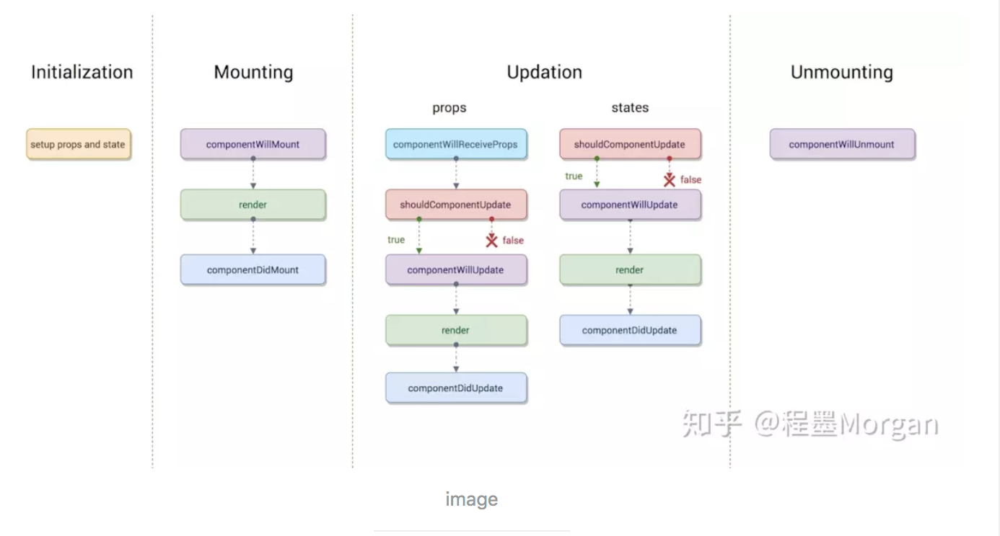

#### react生命周期函数详解


#### 组件初始化(initialization)阶段
`constructor()`用来做一些组件的初始化工作，如定义`this.state`的初始内容；`super(props)`用来调用基类的构造方法, 也将父组件的`props`注入给子组件
``` js
import React, { Component } from 'react';
class Test extends Component {
  constructor(props) {
    super(props);
  }
  this.state = { 
    someThings:'我是一个msg'
  };
}
```

#### 第二个是组件的挂载(Mounting)阶段
此阶段分为`componentWillMount`，`render`，`componentDidMount`三个时期。
- `componentWillMount`：在组件挂载到`DOM`前调用，且只会被调用一次，在这边调用`this.setState`不会引起组件重新渲染，也可以把写在这边的内容提前到`constructor()`中，所以项目中很少用。
- `render`：根据组件的`props`和`state`去渲染出页面DOM（无两者的重传递和重赋值，论值是否有变化，都可以引起组件重新render）
- `componentDidMount`：组件挂载到DOM后触发的生命周期函数，且只会被调用一次，dom操作放在这个里面，请求数据也放在这个里面

#### 第三个是组件的更新(update)阶段
react组件更新机制：setState引起的state更新或父组件重新render引起的props更新，更新后的state和props相对之前无论是否有变化，都将引起子组件的重新render。
此阶段分为`componentWillReceiveProps`，`shouldComponentUpdate`，`componentWillUpdate`，`render`，`componentDidUpdate`
- `componentWillReceiveProps(nextProps)`：此方法只调用于props引起的组件更新过程中，参数nextProps是父组件传给当前组件的新props。
- `shouldComponentUpdate(nextProps, nextState)`：此方法通过比较nextProps，nextState及当前组件的this.props，this.state，返回`true`时当前组件将继续执行更新过程，返回false则当前组件更新停止，以此可用来减少组件的不必要渲染，优化组件性能。
``` js
//是否要更新数据  如果返回true才会执行更新数据的操作
shouldComponentUpdate(nextProps, nextState){ // 应该使用这个方法，否则无论state是否有变化都将会导致组件重新渲染
        if(nextStates.someThings === this.state.someThings){
          return false
        }
        if(nextProps.someThings === this.props.someThings){
          return false
        }
    }
```
- `componentWillUpdate(nextProps, nextState)`：此方法在调用render方法前执行，在这边可执行一些组件更新发生前的工作，一般较少用。
- `render`
- `componentDidUpdate(prevProps, prevState)`：此方法在组件更新后被调用，可以操作组件更新的DOM，prevProps和prevState这两个参数指的是组件更新前的props和state

#### 卸载阶段
此阶段只有一个生命周期方法：`componentWillUnmount`
- componentWillUnmount：此方法在组件被卸载前调用，可以在这里执行一些清理工作，比如清楚组件中使用的定时器，清楚componentDidMount中手动创建的DOM元素等，以避免引起内存泄漏。